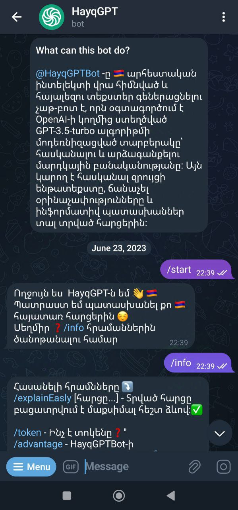

## Hayq GPT Telegram Bot

I developed a Telegram bot using the ChatGPT API that offers an intuitive interface and excels in Armenian language interactions. This bot leverages advanced natural language processing to provide accurate and context-aware responses, making it more effective for Armenian-speaking users compared to other solutions. The user-friendly design enhances engagement, allowing seamless conversations and easy navigation. Continuous improvements based on user feedback ensure it remains a valuable tool for its audience.

###/info command 

