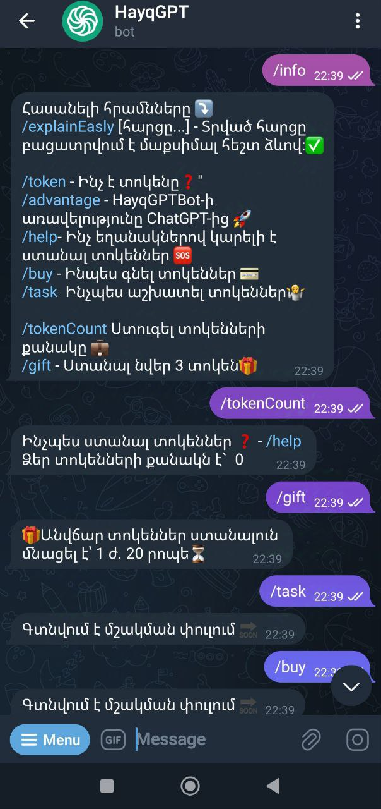
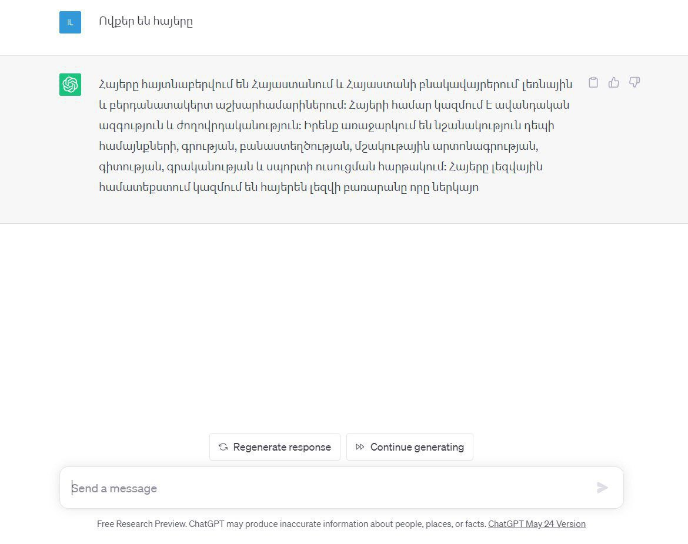
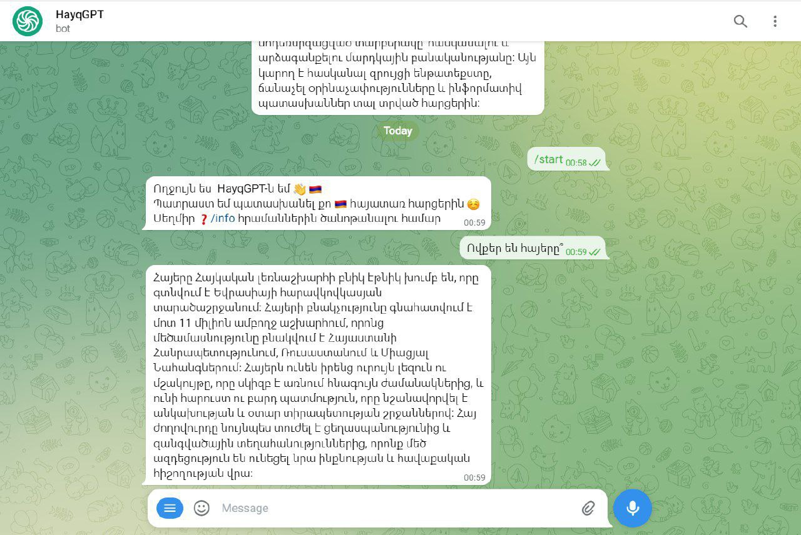

## Hayq GPT Telegram Bot

A Telegram bot has been developed using the ChatGPT API, featuring an intuitive interface that excels in Armenian language interactions. Leveraging advanced natural language processing, this bot delivers accurate and context-aware responses, making it an effective solution for Armenian-speaking users. Its user-friendly design fosters engagement, enabling seamless conversations and easy navigation. Continuous incorporation of user feedback ensures the bot evolves and remains a valuable resource for its audience.

### /info command 

## Advantages
Thanks to the specially developed algorithm, HayqGPT is able to generate Armenian texts 90% more efficiently than ChatGPT.

## ChatGPT 

## HayqGPT

